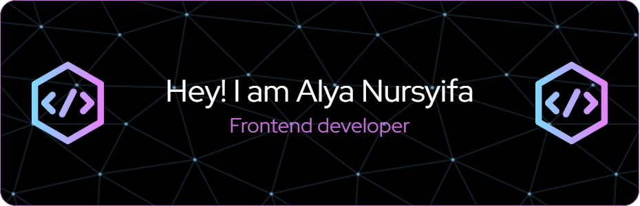

  

  

  
  </a>
    
<a href="mailto:alyasyf448@gmail.com">
    

<h4 >Languages and Tools :

</h4>

  

<!-- - 👋 Hi, I’m @alyaasyifa
- 👀 I’m interested in ...
- 🌱 I’m currently learning ...
- 💞️ I’m looking to collaborate on ...
- 📫 How to reach me ... -->